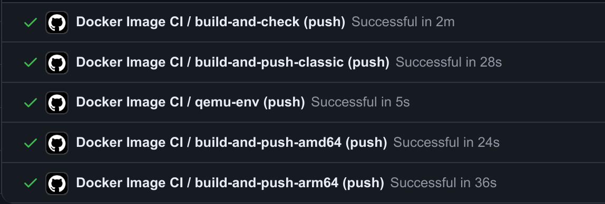
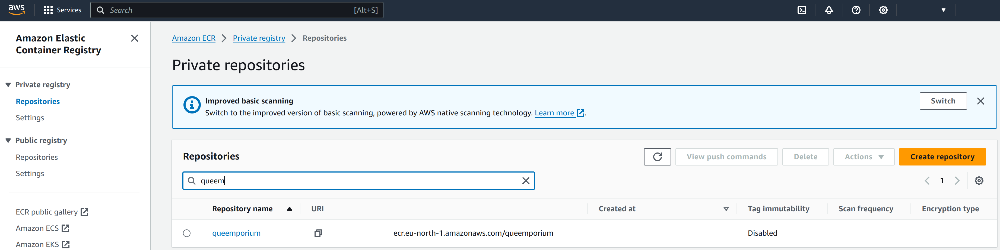
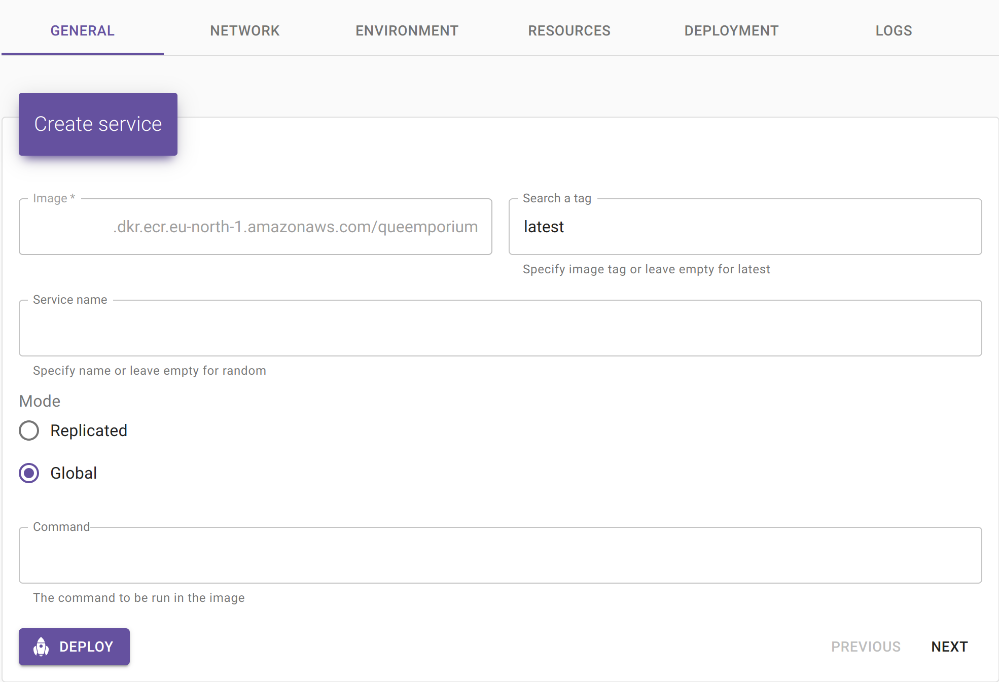
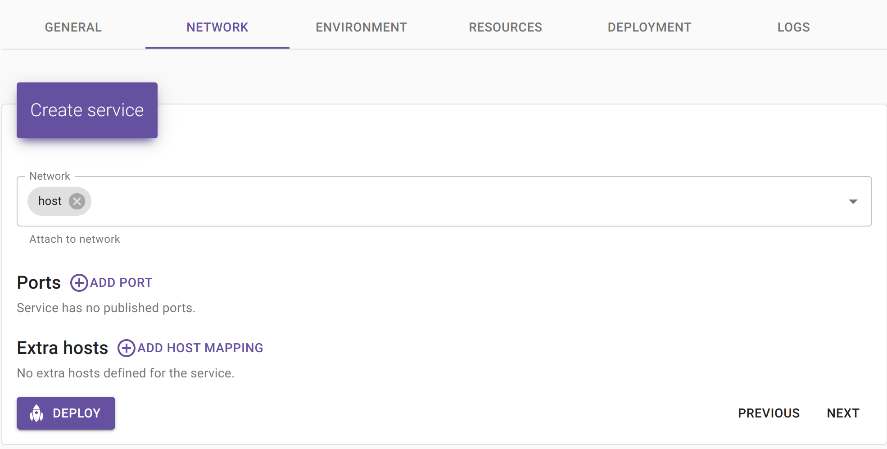
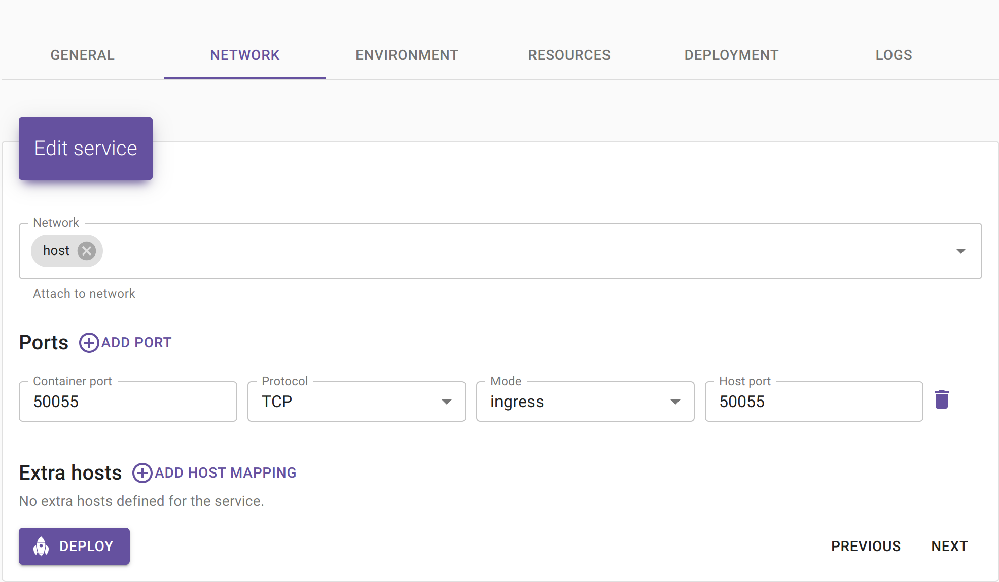
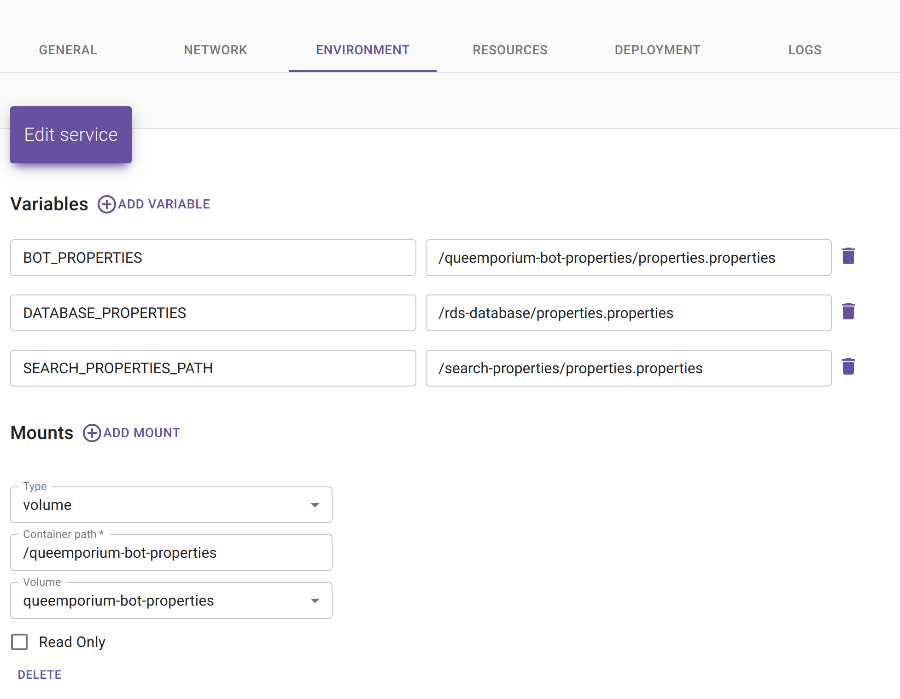
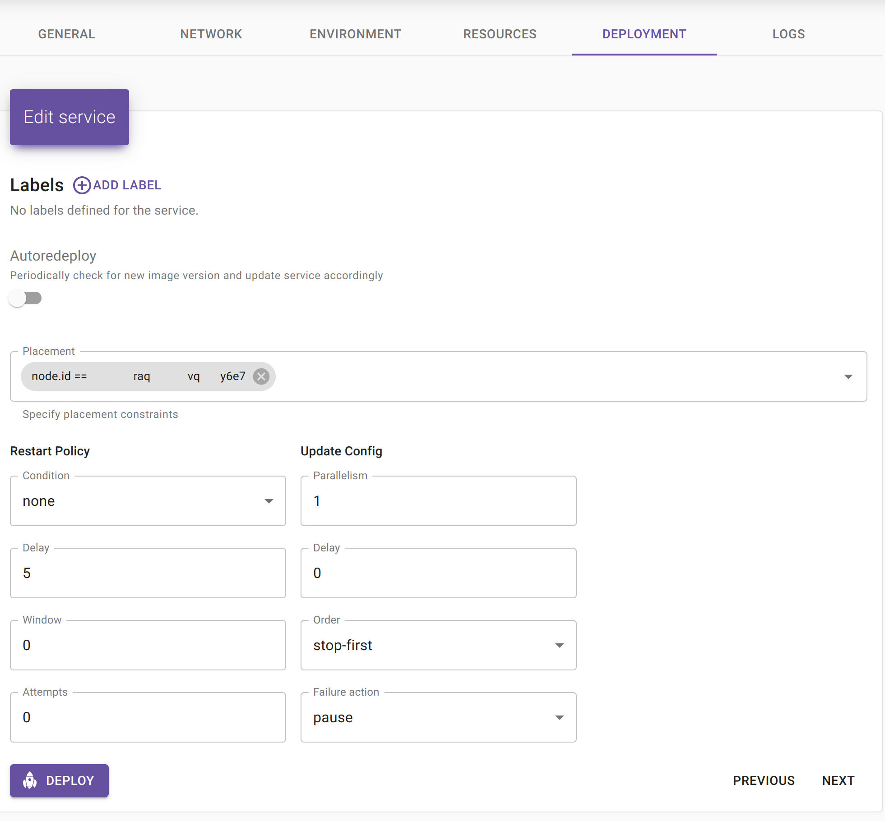

# Instructions on how to start a server for the Discord bot system.

In general, you can use any hosting service or even do it on your own laptop. The following describes one of the options implemented on my end.

So, my option is:

1. GitHub CI to create a Docker Image.
2. Amazon ECR for storing the Docker Image.
3. Amazon EC2 to run the Docker Image.
4. Swarmpit to run the Docker Image.

## GitHub CI

You can find `.github/workflows/` the current GitHub CI in the repository. It usually includes building, test validation, building the jar, and saving it to the Amazon ECR system.

An example of what CI might look like:


Here we can see the three push steps that are responsible for pushing the image to Amazon ECR. You can change these steps to push the image to another location, such as GitHub Registry.

You need to add four keys if we are talking about the interaction between GitHub CI and Amazon ECR.

### AWS IAM

To use Amazon ECR, you need to create a password that will give you access to ECR. To do this, you need to have an Amazon account. Go to Amazon IAM and create a user. Give it permissions:

- `AmazonEC2ContainerRegistryFullAccess`
- `AmazonEC2ContainerRegistryPowerUser`
- `GetSecretValue`
- `SecretsManagerReadWrite`

Create an Access Key and download the key_id and secret_key_id.

### GitHub Secrets

- `AWS_ACCESS_KEY_ID`: key_id from a previous step.
- `AWS_ACCESS_SECRET_KEY_ID`: secret_key_id from a previous step.
- `AWS_ECR_REPOSITORY`: the url we'll get in the next step
- `AWS_REGION`: the region in which our Amazon operates

## Amazon ECR



We have to go into Amazon ECR and create a repository. In my case, it was a private repository. Create it and remember where it is, and its URI.

`AWS_ECR_REPOSITORY` from previous step is this URI. Looks like `12345678.dkr.ecr.eu-north-1.amazonaws.com/your-repository-name`. 

`AWS_REGION` from previous step can be taken here too. Looks like `eu-north-2`.

Remember that all your images will be copied into new images, which means they will accumulate over time. Set up auto-deletion or go to the repository and delete unnecessary images at push.

## Amazon EC2

Creating a machine does not require any special knowledge. However, keep an eye on the capacity of the machine. Sometimes one big machine will be enough for you, sometimes you can split everything into several small machines. You don't have to worry about the network, we will connect all the docker swarms later.

## Swarmpit

Now let's talk about the hardest part of setting up the machine itself. We need to configure the machine itself. Here I will provide instructions on how to set up a Linux machine (because I recommend using it), and I will use Ubuntu (because I like it).

You should already have ssh access to the machine and run different commands on it.

We will have two sides: first there will be a manager, who will manage everything, and workers, on whom tasks will be launched. Of course, the manager is also a worker himself. But it is better if the manager is separate, because if the task breaks the machine, the manager will not be broken with it, but it is not necessary.

### Manager side

Here we just need to install swarmpit and docker.

[Docker install](https://docs.docker.com/engine/install/). There's a handy script for Ubuntu. I suggest making it so that you can run it without sudo - so `docker run hello-world` will be finished without a problem.

[Swarmpit install](https://github.com/swarmpit/swarmpit). Make sure you open the required port in your machine (for example, in the case of Amazon, you have to do this in the UI). For example, the default port is 888, which is usually closed. Make sure you can open the site at this address.

Now, if you want to connect workers, you will need to get a connection token. This is obtained with the command:
`docker swarm join-token worker`

You will get a command that you will need to execute on the workers.

Let's configure that we can get Docker Image from Amazon ECR. To do this, go to Swarmpit, go to Registries, select Amazon ECR, fill in all the required fields (key_id secret_key_id), and click add.

### Worker side

[Docker install](https://docs.docker.com/engine/install/). There's a handy script for Ubuntu. I suggest making it so that you can run it without sudo - so `docker run hello-world` will be finished without a problem.

### Launching

Let's run example: queemporium-bot. We already should have Registry in UI.

1. Go to "Services", click "New Service".
2. Select in registry your registry (not "public"), and select repository from list below.
3. Select a tag (for me, it is the latest, but it can be different). Select "Network"

4. Here we meet the very first enemy: ports. We need to select the right network, for me it's always “host”. Now we need to select the ports that our service occupies. Usually this is specified in the repository, but in our case it's empty. In the case of duplicate-image-service it will be port 50055. Go to "environment".
Queemporium:

Duplicate service:


5. Now let's move on to variables and volumes. Information about what variables and volumes are needed for this service. Let's deal with volumes first. The volume must be created on the worker's machine, that's where we'll create it. Usually it will be just properties, or a file in general. For example, the path will be bot-properties.
<br><br>1. Create the bot-properties directory via `mkdir bot-properties`.
<br>2. Create a properties.properties file via `touch properties.properties`.
<br>3. Put what you want in there via `nano properties.properties`.
<br><br>Now go to the folder that contains bot-properties and create the update-files.sh file there. Allow it to run via `chmod u+x update-files.sh`. Fill it with `nano update-files.sh`.
<br>
```
docker run -v queemporium-bot-properties:/queemporium-bot-properties --name helper busybox true &&
docker cp bot-properties/properties.properties helper:/queemporium-bot-properties &&
docker rm helper
```
<br>Every time we update bot-properties, we can run this script and everything will be updated.
<br>Now let's move on to the variables. Sometimes it can be a simple string, sometimes it can be a file path. I want to fill `BOT_PROPERTIES` with the path `/queemporium-bot-properties/properties.properties`


6. Next step is Deployment. Add filter by node, and turn off restart (to avoid restarting)

7. LOGS TODO, but you can just select JSON logs.